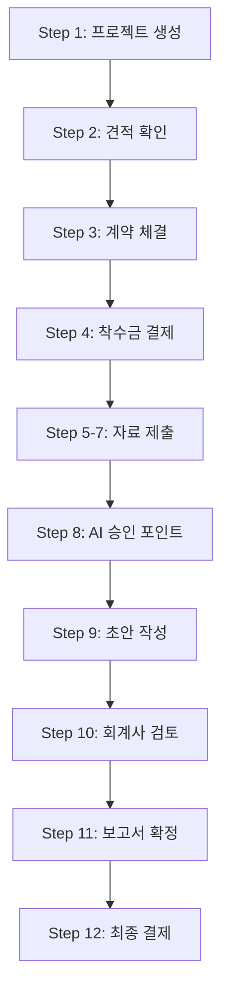

# ValueLink Architecture Guide

**시스템 아키텍처, 디자인 패턴, 기술 스택**

**Version**: 1.0
**Last Updated**: 2026-02-22

---

## 목차

1. [시스템 개요](#1-시스템-개요)
2. [기술 스택](#2-기술-스택)
3. [아키텍처 패턴](#3-아키텍처-패턴)
4. [데이터베이스 스키마](#4-데이터베이스-스키마)
5. [API 설계](#5-api-설계)
6. [평가 엔진 구조](#6-평가-엔진-구조)
7. [크롤러 구조](#7-크롤러-구조)
8. [스케줄러 구조](#8-스케줄러-구조)
9. [인증 및 권한](#9-인증-및-권한)
10. [보안 고려사항](#10-보안-고려사항)

---

## 1. 시스템 개요

ValueLink는 AI 기반 기업가치 평가 자동화 플랫폼으로, 5가지 평가 방법론을 지원하며 12단계 워크플로우와 22개 AI 승인 포인트를 통해 고품질의 평가 보고서를 생성합니다.

### 핵심 개념

#### 1.1 Project (프로젝트)

고객의 평가 요청 단위. 하나의 프로젝트는 1개 이상의 평가 방법을 선택할 수 있습니다.

**구성 요소**:
- `project_id`: VL-YYYYMMDD-XXXX 형식
- `user_id`: 요청 고객
- `accountant_id`: 담당 회계사
- `requested_methods`: 선택된 평가법 배열

**생명주기**:
```
요청 생성 → 견적 확인 → 계약 → 자료 제출 → AI 분석 →
승인 포인트 검토 → 초안 작성 → 회계사 검토 → 최종 확정 → 완료
```

#### 1.2 Valuation Method (평가 방법)

5가지 평가 방법론:

| 코드 | 이름 | 설명 |
|------|------|------|
| `dcf` | 현금흐름할인법 | 미래 FCF를 WACC로 할인 |
| `relative` | 상대가치평가법 | 동종업체 Multiple (PER, PBR, EV/EBITDA, PSR) |
| `asset` | 자산기준가치평가법 | 순자산 공정가치 재평가 |
| `intrinsic` | 본질가치평가법 | 순자산가치 + 수익가치 가중평균 |
| `tax` | 상증세법 | 순자산가치 + 순손익가치 (3:2 가중) |

#### 1.3 Approval Point (승인 포인트)

AI가 제안한 가정을 회계사가 승인/거부/수정하는 결정 지점. 총 22개.

**DCF (8개)**:
- JP001: WACC 산정 (가중평균자본비용)
- JP002: 영구성장률 (Terminal Growth Rate)
- JP003: FCF 예측 (5-10년 현금흐름)
- JP004: NOPAT 계산 (세후영업이익)
- JP005: 운전자본 증감
- JP006: CAPEX 추정
- JP007: 감가상각비
- JP008: 순차입금 조정

**Relative (4개)**:
- JP009: 동종업체 선정
- JP010: Multiple 선택 (PER/PBR/EV/EBITDA/PSR)
- JP011: 프리미엄/디스카운트 적용
- JP012: 시장 상황 고려

**Asset (6개)**:
- JP013: 자산 재평가 (유형자산)
- JP014: 무형자산 평가
- JP015: 재고자산 평가
- JP016: 부채 조정
- JP017: 우발부채 반영
- JP018: 공정가치 조정

**Intrinsic (2개)**:
- JP019: 순자산가치 가중치
- JP020: 수익가치 가중치

**Tax (2개)**:
- JP021: 순자산가치 가중치 (기본 0.4)
- JP022: 순손익가치 가중치 (기본 0.6)

#### 1.4 Role (역할)

4가지 사용자 역할:

| 역할 | 코드 | 권한 |
|------|------|------|
| 고객 | `customer` | 프로젝트 생성, 자료 제출, 승인 포인트 결정 |
| 회계사 | `accountant` | 초안 작성, 검토, 보고서 확정 |
| 관리자 | `admin` | 전체 프로젝트 관리, 회계사 배정, 시스템 설정 |
| 투자자 | `investor` | 투자 뉴스 트래커 열람 (선택) |

### 시스템 흐름 (12단계)



---

## 2. 기술 스택

### Frontend

| 기술 | 버전 | 용도 | 선택 이유 |
|------|------|------|----------|
| **Next.js** | 14.2 | React 프레임워크 | App Router, SSR, RSC, 라우팅 내장 |
| **React** | 18.3 | UI 라이브러리 | Streaming, Suspense, Server Components |
| **TypeScript** | 5.6 | 정적 타입 | 타입 안정성, 자동 완성, 리팩토링 |
| **Tailwind CSS** | 3.4 | CSS 프레임워크 | 유틸리티 퍼스트, 빠른 프로토타이핑 |

### Backend

| 기술 | 용도 | 선택 이유 |
|------|------|----------|
| **Supabase** | PostgreSQL DB + Auth + Storage | 관리형 DB, RLS, 실시간 구독, Storage |
| **Vercel** | 서버리스 배포 + Edge Functions | Next.js 최적화, 자동 스케일링, Cron Jobs |

### AI

| API | 용도 | 선택 이유 |
|-----|------|----------|
| **Claude (Anthropic)** | 문서 분석, 승인 포인트 생성 | 긴 컨텍스트 (200K tokens), JSON mode |
| **Gemini (Google)** | 뉴스 기사 점수 시스템 | Function calling, 빠른 응답 |
| **OpenAI** | 보고서 초안 작성 (선택) | GPT-4 고품질 텍스트 생성 |

### 크롤링

| 기술 | 용도 | 선택 이유 |
|------|------|----------|
| **Cheerio** | HTML 파싱 | 빠른 jQuery 스타일 파싱 |
| **Axios** | HTTP 요청 | Promise 기반, 간결한 API |

### 테스팅

| 기술 | 용도 |
|------|------|
| **Jest** | 단위 테스트 |
| **Playwright** | E2E 테스트 |
| **React Testing Library** | 컴포넌트 테스트 |

---

## 3. 아키텍처 패턴

### 3.1 4계층 아키텍처

```
┌─────────────────────────────────────────────────────────────┐
│  Presentation Layer (app/, components/)                     │
│  - Next.js Pages (RSC)                                      │
│  - React Components                                         │
│  - Tailwind CSS                                             │
└─────────────────────────────────────────────────────────────┘
                              ↓
┌─────────────────────────────────────────────────────────────┐
│  Application Layer (lib/workflow/, lib/ai/)                 │
│  - Workflow Manager (12단계 상태 관리)                        │
│  - Approval Points (22개 승인 로직)                          │
│  - AI Client (Claude, Gemini, OpenAI)                       │
└─────────────────────────────────────────────────────────────┘
                              ↓
┌─────────────────────────────────────────────────────────────┐
│  Domain Layer (valuation/engines/, types/)                  │
│  - Valuation Engines (5개 평가 엔진)                         │
│  - Financial Math (WACC, NPV, IRR 등)                       │
│  - Business Logic                                           │
└─────────────────────────────────────────────────────────────┘
                              ↓
┌─────────────────────────────────────────────────────────────┐
│  Infrastructure Layer (lib/supabase/, lib/email/)           │
│  - Supabase Client (DB, Auth, Storage)                      │
│  - Email Service (Resend)                                   │
│  - Notifications Service                                    │
└─────────────────────────────────────────────────────────────┘
```

### 3.2 디자인 패턴

#### Orchestrator 패턴 (평가 엔진 관리)

```typescript
class ValuationOrchestrator {
  private engines: Map<ValuationMethod, ValuationEngine>;

  registerEngine(method: ValuationMethod, engine: ValuationEngine) {
    this.engines.set(method, engine);
  }

  async executeValuation(input: ValuationInput): Promise<ValuationResult> {
    const engine = this.engines.get(input.method);
    if (!engine) {
      throw new Error(`Engine not found for method: ${input.method}`);
    }

    // 1. 검증
    const validation = engine.validate(input);
    if (!validation.valid) {
      throw new Error(validation.error);
    }

    // 2. 계산
    const result = await engine.calculate(input);

    // 3. DB 저장
    await this.saveResult(result);

    return result;
  }
}
```

#### Abstract Class 패턴 (평가 엔진 기본 클래스)

```typescript
abstract class ValuationEngine {
  // 추상 메서드 (구현체에서 반드시 구현)
  abstract getName(): string;
  abstract validate(data: ValuationInput): ValidationResult;
  abstract calculate(data: ValuationInput): Promise<ValuationResult>;

  // 공통 메서드
  protected formatCurrency(value: number): string {
    return new Intl.NumberFormat('ko-KR', {
      style: 'currency',
      currency: 'KRW'
    }).format(value);
  }
}
```

#### Singleton 패턴 (Supabase 클라이언트)

```typescript
let supabaseClient: SupabaseClient | null = null;

export function getSupabaseClient(): SupabaseClient {
  if (!supabaseClient) {
    supabaseClient = createClient(
      process.env.NEXT_PUBLIC_SUPABASE_URL!,
      process.env.NEXT_PUBLIC_SUPABASE_ANON_KEY!
    );
  }
  return supabaseClient;
}
```

#### Strategy 패턴 (민감도 분석)

```typescript
interface SensitivityStrategy {
  analyze(baseResult: ValuationResult): SensitivityAnalysisResult;
}

class WACCGrowthSensitivity implements SensitivityStrategy {
  analyze(baseResult: ValuationResult): SensitivityAnalysisResult {
    // WACC x Growth Rate 매트릭스 생성
  }
}

class AssetAdjustmentSensitivity implements SensitivityStrategy {
  analyze(baseResult: ValuationResult): SensitivityAnalysisResult {
    // 자산 조정률에 따른 가치 변화
  }
}
```

---

## 4. 데이터베이스 스키마

### 4.1 핵심 테이블 (11개)

| 테이블 | 설명 | 주요 컬럼 |
|--------|------|----------|
| `users` | 사용자 프로필 | user_id, email, name, role, company_name |
| `accountants` | 회계사 정보 | accountant_id, user_id, license_number, specialization |
| `customers` | 고객사 정보 | customer_id, user_id, company_name, business_number |
| `evaluation_requests` | 평가 요청 (관리자 승인 대기) | request_id, user_id, status, requested_methods |
| `projects` | 진행 중 프로젝트 (승인된 것만) | project_id, user_id, accountant_id, status, current_step |
| `project_history` | 완료된 프로젝트 | history_id, project_id, completed_at, final_values |
| `valuation_reports` | 샘플 보고서 (DART/KIND) | company_name, valuation_method, valuation_amount |
| `deals` | 투자 딜 뉴스 | company_name, stage, investors, amount |
| `investment_news_articles` | 투자 뉴스 기사 | article_url, company_name, score, processed |
| `balance_payments` | 잔금 결제 | project_id, method, amount, status |
| `report_delivery_requests` | 보고서 수령 요청 | project_id, method, delivery_type |

### 4.2 평가법별 분리 테이블 (30개 = 6종류 x 5평가법)

**6가지 테이블 종류**:
1. Documents (자료 업로드)
2. Approval Points (AI 승인 포인트)
3. Results (평가 결과)
4. Drafts (보고서 초안)
5. Revisions (수정 요청)
6. Reports (최종 보고서)

**예시 (DCF)**:
- `dcf_documents`
- `dcf_approval_points`
- `dcf_results`
- `dcf_drafts`
- `dcf_revisions`
- `dcf_reports`

**동일 구조**: `relative_*, asset_*, intrinsic_*, tax_*`

### 4.3 RLS 정책 예시

#### users 테이블

```sql
-- 본인 프로필만 조회 가능
CREATE POLICY "Users can view own profile"
ON users FOR SELECT
USING (auth.uid() = user_id);

-- 본인 프로필만 수정 가능
CREATE POLICY "Users can update own profile"
ON users FOR UPDATE
USING (auth.uid() = user_id);
```

#### projects 테이블

```sql
-- 본인 또는 담당 회계사만 조회 가능
CREATE POLICY "Users can view own projects"
ON projects FOR SELECT
USING (auth.uid() = user_id OR auth.uid() = accountant_id);

-- 고객만 생성 가능
CREATE POLICY "Customers can create projects"
ON projects FOR INSERT
WITH CHECK (auth.uid() = user_id);
```

#### dcf_documents 테이블

```sql
-- 프로젝트 참여자만 조회 가능
CREATE POLICY "Project participants can view documents"
ON dcf_documents FOR SELECT
USING (
  project_id IN (
    SELECT project_id FROM projects
    WHERE user_id = auth.uid() OR accountant_id = auth.uid()
  )
);

-- 프로젝트 소유자만 업로드 가능
CREATE POLICY "Project owners can upload documents"
ON dcf_documents FOR INSERT
WITH CHECK (
  project_id IN (
    SELECT project_id FROM projects
    WHERE user_id = auth.uid()
  )
);
```

### 4.4 트리거 (8개)

| 트리거 | 테이블 | 동작 | 목적 |
|--------|--------|------|------|
| `update_updated_at` | 모든 테이블 | UPDATE | updated_at 자동 업데이트 |
| `validate_project_status` | projects | UPDATE | 상태 전이 유효성 검증 |
| `notify_accountant` | projects | INSERT | 회계사에게 배정 알림 |
| `notify_customer` | drafts | UPDATE | 고객에게 초안 완료 알림 |
| `log_approval_decision` | approval_points | UPDATE | 승인 결정 이력 로그 |
| `calculate_project_progress` | projects | UPDATE | 진행률 자동 계산 |
| `update_accountant_stats` | projects | UPDATE | 회계사 통계 업데이트 |
| `archive_completed_project` | projects | UPDATE | 완료 프로젝트 자동 아카이빙 |

---

## 5. API 설계

### 5.1 RESTful API 규칙

| 메서드 | 경로 | 동작 |
|--------|------|------|
| GET | `/api/projects` | 프로젝트 목록 조회 |
| GET | `/api/projects/:id` | 프로젝트 상세 조회 |
| POST | `/api/projects` | 프로젝트 생성 |
| PATCH | `/api/projects/:id` | 프로젝트 수정 |
| DELETE | `/api/projects/:id` | 프로젝트 삭제 |

### 5.2 주요 엔드포인트

#### Auth

```
POST   /api/auth/login           # 이메일 로그인
POST   /api/auth/logout          # 로그아웃
GET    /api/auth/session         # 세션 확인
POST   /api/auth/signup          # 회원가입
```

#### Projects

```
GET    /api/projects                # 프로젝트 목록
GET    /api/projects/:id            # 프로젝트 상세
POST   /api/projects                # 프로젝트 생성
PATCH  /api/projects/:id            # 프로젝트 수정
DELETE /api/projects/:id            # 프로젝트 삭제
GET    /api/projects/:id/documents  # 자료 목록
POST   /api/projects/:id/documents  # 자료 업로드
```

#### Quotes (견적)

```
GET    /api/quotes/:projectId       # 견적 조회
POST   /api/quotes/:projectId       # 견적 생성
```

#### Valuation

```
POST   /api/valuation/dcf           # DCF 평가 실행
POST   /api/valuation/relative      # Relative 평가 실행
GET    /api/valuation/results/:id   # 평가 결과 조회
POST   /api/valuation/sensitivity   # 민감도 분석
```

#### Approval Points

```
GET    /api/approval-points/:projectId/:method  # 승인 포인트 목록
POST   /api/approval-points/:id/approve         # 승인
POST   /api/approval-points/:id/reject          # 거부
POST   /api/approval-points/:id/customize       # 커스터마이즈
```

#### Scheduler

```
POST   /api/cron/collect-news       # 뉴스 수집 (Cron Job)
GET    /api/scheduler/status        # 스케줄러 상태
POST   /api/scheduler/trigger       # 수동 트리거
```

### 5.3 에러 응답 형식

```typescript
{
  "error": {
    "code": "VALIDATION_ERROR",
    "message": "WACC must be between 0 and 1",
    "details": {
      "field": "wacc",
      "value": 1.2,
      "constraint": "0 < wacc < 1"
    }
  }
}
```

#### 에러 코드

| 코드 | HTTP Status | 설명 |
|------|-------------|------|
| `VALIDATION_ERROR` | 400 | 입력 검증 실패 |
| `UNAUTHORIZED` | 401 | 인증 실패 |
| `FORBIDDEN` | 403 | 권한 없음 |
| `NOT_FOUND` | 404 | 리소스 없음 |
| `INTERNAL_ERROR` | 500 | 서버 에러 |

---

## 6. 평가 엔진 구조

### 6.1 오케스트레이터

```typescript
class ValuationOrchestrator {
  private engines: Map<ValuationMethod, ValuationEngine> = new Map();

  constructor() {
    // 5개 엔진 등록
    this.registerEngine('dcf', new DCFEngine());
    this.registerEngine('relative', new RelativeEngine());
    this.registerEngine('asset', new AssetEngine());
    this.registerEngine('intrinsic', new IntrinsicEngine());
    this.registerEngine('tax', new TaxEngine());
  }

  async executeValuation(input: ValuationInput): Promise<ValuationResult> {
    const engine = this.engines.get(input.method);
    return await engine.calculate(input);
  }
}
```

### 6.2 추상 엔진 클래스

```typescript
abstract class ValuationEngine {
  abstract getName(): string;
  abstract validate(data: ValuationInput): ValidationResult;
  abstract calculate(data: ValuationInput): Promise<ValuationResult>;

  // 공통 메서드
  protected logCalculation(step: string, value: number) {
    console.log(`[${this.getName()}] ${step}: ${value}`);
  }
}
```

### 6.3 DCF 엔진 예시

```typescript
class DCFEngine extends ValuationEngine {
  getName(): string {
    return 'DCF';
  }

  validate(data: ValuationInput): ValidationResult {
    if (!data.cashFlows || data.cashFlows.length === 0) {
      return { valid: false, error: 'Cash flows required' };
    }
    if (!data.wacc || data.wacc <= 0 || data.wacc >= 1) {
      return { valid: false, error: 'WACC must be between 0 and 1' };
    }
    if (data.terminalGrowthRate! >= data.wacc!) {
      return { valid: false, error: 'Growth rate must be less than WACC' };
    }
    return { valid: true };
  }

  async calculate(data: ValuationInput): Promise<ValuationResult> {
    const { cashFlows, wacc, terminalGrowthRate, netDebt, sharesOutstanding } = data;

    // 1. NPV 계산
    const npv = calculateNPV(cashFlows!, wacc!);

    // 2. Terminal Value 계산
    const lastCF = cashFlows![cashFlows!.length - 1];
    const terminalValue = calculateTerminalValue(lastCF, terminalGrowthRate!, wacc!);
    const pvTerminal = terminalValue / Math.pow(1 + wacc!, cashFlows!.length);

    // 3. Enterprise Value
    const enterpriseValue = npv + pvTerminal;

    // 4. Equity Value
    const equityValue = enterpriseValue - netDebt!;

    // 5. Value Per Share
    const valuePerShare = equityValue / sharesOutstanding!;

    return {
      method: 'dcf',
      projectId: data.projectId!,
      enterpriseValue,
      equityValue,
      valuePerShare,
      details: {
        npv,
        terminalValue,
        pvTerminal
      },
      calculatedAt: new Date().toISOString()
    };
  }
}
```

### 6.4 재무 수학 라이브러리

```typescript
// WACC 계산
export function calculateWACC(
  equity: number,
  debt: number,
  costOfEquity: number,
  costOfDebt: number,
  taxRate: number
): number {
  const totalCapital = equity + debt;
  const equityWeight = equity / totalCapital;
  const debtWeight = debt / totalCapital;

  return equityWeight * costOfEquity + debtWeight * costOfDebt * (1 - taxRate);
}

// NPV 계산
export function calculateNPV(cashFlows: number[], discountRate: number): number {
  return cashFlows.reduce((sum, cf, year) => {
    return sum + cf / Math.pow(1 + discountRate, year + 1);
  }, 0);
}

// IRR 계산 (Newton-Raphson)
export function calculateIRR(cashFlows: number[], initialGuess: number = 0.1): number {
  let irr = initialGuess;
  let tolerance = 0.0001;
  let maxIterations = 100;

  for (let i = 0; i < maxIterations; i++) {
    const npv = calculateNPV(cashFlows, irr);
    const derivative = calculateNPVDerivative(cashFlows, irr);
    const nextIRR = irr - npv / derivative;

    if (Math.abs(nextIRR - irr) < tolerance) {
      return nextIRR;
    }
    irr = nextIRR;
  }
  throw new Error('IRR did not converge');
}

// Terminal Value (Gordon Growth Model)
export function calculateTerminalValue(
  lastCashFlow: number,
  growthRate: number,
  discountRate: number
): number {
  return lastCashFlow * (1 + growthRate) / (discountRate - growthRate);
}

// FCF 계산
export function calculateFCF(
  nopat: number,
  depreciation: number,
  capex: number,
  deltaWorkingCapital: number
): number {
  return nopat + depreciation - capex - deltaWorkingCapital;
}
```

---

## 7. 크롤러 구조

### 7.1 아키텍처 다이어그램

```
┌─────────────────────────────────────────────────────────────┐
│  CrawlerManager                                             │
│  - 6개 사이트별 크롤러 관리                                    │
│  - 병렬 실행                                                  │
│  - 에러 핸들링                                                │
└─────────────────────────────────────────────────────────────┘
                              ↓
┌─────────────────────────────────────────────────────────────┐
│  BaseCrawler (추상 클래스)                                    │
│  - 공통 메서드: fetch(), parse(), save()                     │
│  - 추상 메서드: getUrls(), extractData()                     │
└─────────────────────────────────────────────────────────────┘
                              ↓
┌─────────────────────────────────────────────────────────────┐
│  사이트별 크롤러 (6개)                                         │
│  - VentureSquareCrawler                                     │
│  - StartupTodayCrawler                                      │
│  - OutstandingCrawler                                       │
│  - TheBCCrawler                                             │
│  - StartupNCrawler                                          │
│  - GoogleSearchCrawler                                      │
└─────────────────────────────────────────────────────────────┘
```

### 7.2 BaseCrawler (추상 클래스)

```typescript
abstract class BaseCrawler {
  protected siteNumber: number;
  protected siteName: string;

  abstract getUrls(): string[];
  abstract extractData(html: string): Article[];

  async fetch(url: string): Promise<string> {
    const response = await axios.get(url, {
      headers: {
        'User-Agent': 'Mozilla/5.0 ...'
      },
      timeout: 10000
    });
    return response.data;
  }

  async parse(url: string): Promise<Article[]> {
    const html = await this.fetch(url);
    return this.extractData(html);
  }

  async save(articles: Article[]): Promise<void> {
    const { error } = await supabase
      .from('investment_news_articles')
      .insert(articles);
    if (error) throw error;
  }

  async crawl(): Promise<number> {
    let totalCount = 0;
    const urls = this.getUrls();

    for (const url of urls) {
      const articles = await this.parse(url);
      await this.save(articles);
      totalCount += articles.length;
    }

    return totalCount;
  }
}
```

### 7.3 사이트별 크롤러 예시 (VentureSquare)

```typescript
class VentureSquareCrawler extends BaseCrawler {
  constructor() {
    super();
    this.siteNumber = 9;
    this.siteName = '벤처스퀘어';
  }

  getUrls(): string[] {
    return [
      'https://www.venturesquare.net/category/investment-news'
    ];
  }

  extractData(html: string): Article[] {
    const $ = cheerio.load(html);
    const articles: Article[] = [];

    $('article.post').each((_, element) => {
      const title = $(element).find('h2.entry-title a').text().trim();
      const url = $(element).find('h2.entry-title a').attr('href');
      const date = $(element).find('time.entry-date').attr('datetime');

      if (title && url) {
        articles.push({
          site_number: this.siteNumber,
          site_name: this.siteName,
          article_url: url,
          article_title: title,
          published_date: date ? new Date(date) : null
        });
      }
    });

    return articles;
  }
}
```

---

## 8. 스케줄러 구조

### 8.1 TaskScheduler 클래스

```typescript
class TaskScheduler {
  private jobs: Map<string, cron.ScheduledTask> = new Map();

  // 주간 수집 작업 (매일 8am KST)
  scheduleWeeklyCollection() {
    const job = cron.schedule('0 8 * * *', async () => {
      console.log('[Scheduler] Starting weekly news collection...');
      try {
        const manager = new CrawlerManager();
        const result = await manager.crawlAll();

        // 이메일 발송
        await this.sendNotification(result);
      } catch (error) {
        console.error('[Scheduler] Error:', error);
      }
    }, {
      timezone: 'Asia/Seoul'
    });

    this.jobs.set('weekly-collection', job);
  }

  async sendNotification(result: CrawlResult) {
    const emailService = new EmailService();
    await emailService.send({
      to: process.env.ADMIN_EMAIL!,
      subject: `[ValueLink] 투자 뉴스 수집 완료 (${result.totalCount}건)`,
      html: this.formatEmailBody(result)
    });
  }
}
```

### 8.2 Vercel Cron 통합

**vercel.json**:
```json
{
  "crons": [
    {
      "path": "/api/cron/collect-news",
      "schedule": "0 23 * * *"
    }
  ]
}
```

**api/cron/collect-news/route.ts**:
```typescript
export async function GET(request: Request) {
  // CRON_SECRET 검증
  const authHeader = request.headers.get('authorization');
  if (authHeader !== `Bearer ${process.env.CRON_SECRET}`) {
    return new Response('Unauthorized', { status: 401 });
  }

  // 크롤링 실행
  const manager = new CrawlerManager();
  const result = await manager.crawlAll();

  return Response.json({ success: true, result });
}
```

---

## 9. 인증 및 권한

### 9.1 역할 (3개)

| 역할 | 코드 | 권한 |
|------|------|------|
| 고객 | `customer` | 프로젝트 생성, 자료 제출, 승인 포인트 결정 |
| 회계사 | `accountant` | 초안 작성, 검토, 보고서 확정 |
| 관리자 | `admin` | 전체 프로젝트 관리, 회계사 배정 |

### 9.2 인증 흐름

#### 이메일 로그인

```
1. 사용자가 이메일 입력
2. Supabase가 매직 링크 발송
3. 사용자가 링크 클릭
4. Supabase가 JWT 토큰 발급
5. 클라이언트가 토큰 저장 (localStorage)
6. 이후 요청에 토큰 포함
```

#### OAuth (Google)

```
1. 사용자가 "Google 로그인" 클릭
2. Supabase가 Google OAuth 리다이렉트
3. 사용자가 Google에서 승인
4. Google이 콜백 URL로 리다이렉트
5. Supabase가 JWT 토큰 발급
6. 클라이언트가 토큰 저장
```

### 9.3 권한 체크 (미들웨어)

```typescript
// middleware.ts
export async function middleware(request: NextRequest) {
  const { pathname } = request.nextUrl;

  // 인증 필요 경로
  const protectedPaths = ['/valuation', '/projects', '/mypage'];
  const isProtected = protectedPaths.some(path => pathname.startsWith(path));

  if (isProtected) {
    const supabase = createServerClient(request);
    const { data: { session } } = await supabase.auth.getSession();

    if (!session) {
      return NextResponse.redirect(new URL('/login', request.url));
    }

    // 역할 기반 접근 제어
    const { data: user } = await supabase
      .from('users')
      .select('role')
      .eq('user_id', session.user.id)
      .single();

    if (pathname.startsWith('/mypage/admin') && user.role !== 'admin') {
      return NextResponse.redirect(new URL('/forbidden', request.url));
    }
  }

  return NextResponse.next();
}
```

---

## 10. 보안 고려사항

### 10.1 인증 보안

- **JWT 토큰**: Supabase에서 자동 발급, 1시간 유효
- **HTTPS 강제**: Vercel에서 자동 적용
- **CORS**: Supabase에서 허용된 origin만 접근
- **Rate Limiting**: Supabase에서 기본 제공

### 10.2 데이터 보안

- **RLS (Row Level Security)**: 모든 테이블에 적용
- **암호화**: Supabase에서 저장 시 자동 암호화
- **환경 변수**: `.env.local`에 저장 (Git 제외)
- **Secrets**: Vercel에 등록, 코드에 노출 안 됨

### 10.3 API 보안

- **CRON_SECRET**: Cron Job API 인증
- **Input Validation**: 모든 입력값 검증
- **SQL Injection 방지**: Supabase ORM 사용
- **XSS 방지**: React의 자동 이스케이프

### 10.4 파일 보안

- **Storage 권한 정책**: RLS 적용
- **파일 타입 검증**: PDF, Excel만 허용
- **파일 크기 제한**: 10MB

### 10.5 보안 헤더 (vercel.json)

```json
{
  "headers": [
    {
      "source": "/(.*)",
      "headers": [
        {
          "key": "X-Content-Type-Options",
          "value": "nosniff"
        },
        {
          "key": "X-Frame-Options",
          "value": "DENY"
        },
        {
          "key": "X-XSS-Protection",
          "value": "1; mode=block"
        },
        {
          "key": "Strict-Transport-Security",
          "value": "max-age=63072000; includeSubDomains; preload"
        }
      ]
    }
  ]
}
```

---

**Document Version**: 1.0
**Last Updated**: 2026-02-22
**Maintainer**: ValueLink Team
